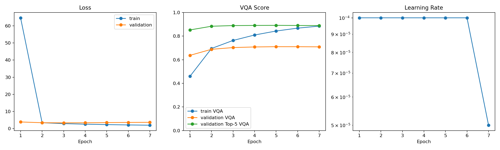

# Model Card / 模型说明

## Overview / 概览

`multimodal-vqa` v0.3.0 provides a ViLT-based Visual Question Answering classifier trained on
VQA v2 with COCO 2014 images. It is the repository's recommended engineering checkpoint.

`multimodal-vqa` v0.3.0 提供基于 ViLT 的视觉问答分类模型，使用 VQA v2 与 COCO 2014
图像训练，是本仓库当前推荐的工程 checkpoint。

- **Task / 任务**: open-ended Visual Question Answering
- **Release / 发布**: [v0.3.0](https://github.com/dongtingshuo/multimodal-vqa/releases/tag/v0.3.0)
- **Checkpoint / 权重**: `best.pt`
- **Architecture / 架构**: ViLT joint vision-language transformer + Top-3000 classifier
- **Source backbone / 源模型**: `dandelin/vilt-b32-mlm-itm`
- **Processor / 处理器**: `dandelin/vilt-b32-finetuned-vqa`
- **Checkpoint format / 格式**: format v3
- **Size / 大小**: 1,409,005,580 bytes
- **SHA256**: `0cce251f02a7b5349b90c0a6e41850168cc01a700f36fe03663887bae7dbf213`

## Intended Use / 预期用途

The checkpoint is intended for English VQA research, reproducible internal evaluation,
single-image inference, and the included Gradio demonstration. It predicts answers from a fixed
Top-3000 normalized vocabulary. It is not a general-purpose generative VLM and is not intended
for safety-critical decisions.

该权重适用于英文 VQA 研究、可复现内部评估、单图推理和仓库内 Gradio 演示。模型从固定的
Top-3000 规范化答案词表中预测，不是通用生成式视觉语言模型，也不适用于安全关键决策。

## Training Data / 训练数据

- VQA v2 train/validation questions and annotations
- COCO 2014 `train2014` and `val2014` images
- 443,757 training questions and 214,354 validation questions passed strict data validation
- 434,635 training examples and 209,608 validation examples were internally scorable under the
  Top-3000 answer vocabulary

- VQA v2 训练/验证 questions 与 annotations
- COCO 2014 `train2014` 与 `val2014` 图像
- 443,757 条训练问题和 214,354 条验证问题通过严格数据校验
- Top-3000 答案词表下可参与内部评分的训练/验证样本分别为 434,635 / 209,608

## Training Configuration / 训练配置

```yaml
seed: 42
model:
  name: vilt
  pretrained_model_name: dandelin/vilt-b32-mlm-itm
  gradient_checkpointing: true
  trainable_layers: 12
data:
  processor_name: dandelin/vilt-b32-finetuned-vqa
  image_size: 384
  max_question_length: 40
  answer_vocab_size: 3000
train:
  batch_size: 4
  gradient_accumulation_steps: 8
  lr: 0.0001
  backbone_lr: 0.00002
  weight_decay: 0.01
  scheduler: warmup_plateau
  early_stopping_patience: 2
  selection_metric: vqa_score
  use_amp: true
```

Epochs 1-2 ran on a Kaggle P100. The format-v3 checkpoint was then continued on one AutoDL
RTX 4090D through epoch 7, where the configured early-stopping rule ended training. Optimizer,
scheduler, AMP scaler, RNG, history, and global-step state were restored at the epoch boundary.

epoch 1-2 在 Kaggle P100 上运行；随后通过 format-v3 checkpoint 在单卡 AutoDL RTX 4090D
上续训至 epoch 7，并按配置触发早停。续训在 epoch 边界恢复 optimizer、scheduler、AMP
scaler、随机数、历史和 global step 状态。

## Validation Results / 验证结果

| Epoch | Train VQA | Val loss | Hard accuracy | Internal VQA | Top-5 VQA | Best |
| ---: | ---: | ---: | ---: | ---: | ---: | :---: |
| 1 | 0.4591 | 3.8765 | 0.5395 | 0.6368 | 0.8519 | yes |
| 2 | 0.6949 | 3.4327 | 0.5891 | 0.6879 | 0.8832 | yes |
| 3 | 0.7629 | 3.3596 | 0.6050 | 0.7027 | 0.8888 | yes |
| 4 | 0.8090 | 3.3900 | 0.6103 | 0.7079 | 0.8899 | yes |
| **5** | **0.8427** | **3.5019** | **0.6126** | **0.7101** | **0.8908** | **yes** |
| 6 | 0.8672 | 3.6097 | 0.6126 | 0.7099 | 0.8895 | no |
| 7 | 0.8843 | 3.6601 | 0.6120 | 0.7089 | 0.8889 | no |

Epoch 5 is selected by validation VQA score. Epochs 6-7 increased training performance while
validation VQA score and loss worsened, providing direct evidence of overfitting and justifying
the early stop.

模型按验证 VQA score 选择 epoch 5。epoch 6-7 的训练指标继续提高，但验证 VQA score 与
loss 变差，直接表明过拟合，因此早停是合理的。

The final prediction export contains 214,354 unique records. Their question IDs exactly match
the complete official validation questions and annotations. A separate full project evaluation
of the selected checkpoint reported hard accuracy `0.6127`, internal VQA score `0.7102`, Top-5
VQA score `0.8908`, and loss `3.5019`.

最终预测文件包含 214,354 条唯一记录，question ID 与完整官方验证 questions 和 annotations
完全一致。对最佳权重的独立项目全量复评结果为：硬准确率 `0.6127`、内部 VQA score
`0.7102`、Top-5 VQA score `0.8908`、loss `3.5019`。



## Evaluation Scope / 评估范围

These are complete project-internal validation metrics, not an official VQA leaderboard score.
The official toolkit adapter is included in the repository and the full prediction export is
preserved, but official toolkit execution is still pending. No leaderboard or cross-project
state-of-the-art claim is made.

以上是完整的项目内部验证指标，不是官方 VQA leaderboard 分数。仓库已提供官方 toolkit
适配器并保留完整预测文件，但官方 toolkit 尚未执行。因此不作 leaderboard 或跨项目 SOTA 声明。

## Comparison / 对比

| Checkpoint | Hard accuracy | Internal VQA | Status |
| --- | ---: | ---: | --- |
| ViLT seed 42 (`v0.3.0`) | **0.6126** | **0.7101** | Recommended engineering checkpoint |
| Staged cross-attention (`v0.2.0`) | 0.5239 | 0.6233 | Archived comparison release |
| Strong cross-attention ablation | 0.4967 | 0.5955 | Not promoted |
| Legacy checkpoint (`v0.1.0`) | 0.4775 | not recorded | Archived |

## Runtime Requirements / 运行要求

The release stores trained model parameters and checkpoint-owned preprocessing configuration.
Runtime construction also requires the Hugging Face ViLT backbone and processor assets. Cache
them once in an online environment before using `demo.py --offline`.

发布权重保存训练参数和 checkpoint 自带的预处理配置。运行时还需要 Hugging Face ViLT
backbone 与 processor 资源；首次联网缓存后，才可使用 `demo.py --offline`。

```bash
python scripts/download_checkpoint.py
python demo.py --checkpoint checkpoints/best.pt
```

## Limitations / 局限

- Fixed Top-3000 answer vocabulary cannot represent every valid answer.
- The default language path expects English questions.
- COCO/VQA domain bias and annotation bias remain present.
- Confidence values are classifier scores and are not calibrated guarantees.
- Official VQA toolkit parity has not yet been asserted.

- 固定 Top-3000 答案词表无法覆盖所有有效答案。
- 默认语言路径面向英文问题。
- 仍存在 COCO/VQA 数据域与标注偏差。
- 置信度是分类器分数，不是经过校准的保证。
- 尚未声明与官方 VQA toolkit 指标完全一致。

## Security / 安全

PyTorch checkpoints use pickle-based serialization. Download only from the official project
Release and verify the published SHA256 before loading.

PyTorch checkpoint 使用基于 pickle 的序列化。请仅从项目官方 Release 下载，并在加载前校验
发布的 SHA256。
